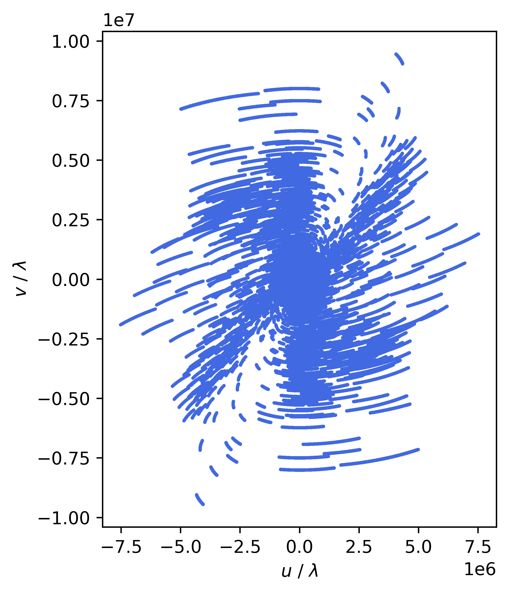
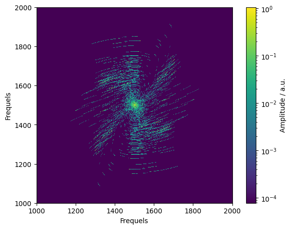
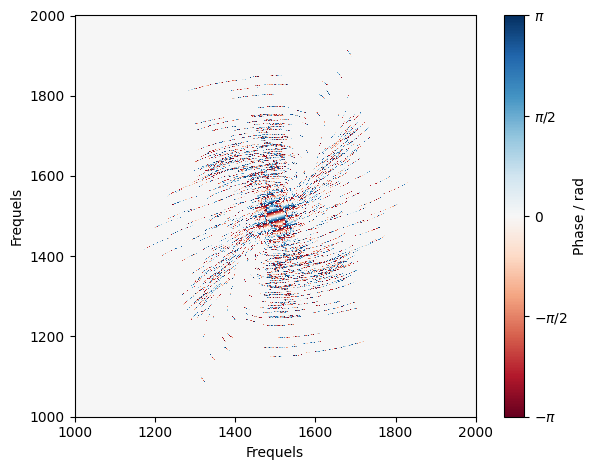
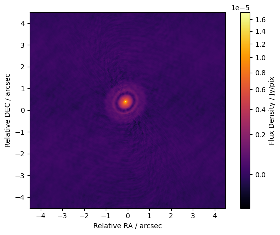
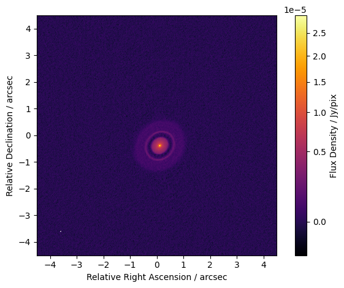

=======================================================================
pyvisgrid |ci| |pre-commit| |codecov| |pypi| |conda| |zenodo| |license|
=======================================================================

.. |ci| image:: https://github.com/radionets-project/pyvisgrid/actions/workflows/ci.yml/badge.svg?branch=main
    :target: https://github.com/radionets-project/pyvisgrid/actions/workflows/ci.yml?branch=main
    :alt: Test Status

.. |codecov| image:: https://codecov.io/github/radionets-project/pyvisgrid/badge.svg
    :target: https://codecov.io/github/radionets-project/pyvisgrid
    :alt: Code coverage

.. |pre-commit| image:: https://results.pre-commit.ci/badge/github/radionets-project/pyvisgrid/main.svg
    :target: https://results.pre-commit.ci/latest/github/radionets-project/pyvisgrid/main
    :alt: pre-commit.ci status

.. |pypi| image:: https://badge.fury.io/py/pyvisgrid.svg
   :target: https://pypi.org/project/pyvisgrid/
   :alt: PyPI version

.. |conda| image:: https://img.shields.io/conda/vn/conda-forge/pyvisgrid.svg
   :target: https://anaconda.org/conda-forge/pyvisgrid
   :alt: Conda Version

.. |zenodo| image:: https://zenodo.org/badge/DOI/10.5281/zenodo.17201290.svg
   :target: https://doi.org/10.5281/zenodo.17201290
   :alt: Zenodo DOI

.. |license| image:: https://img.shields.io/badge/License-MIT-blue.svg
    :target: https://opensource.org/license/mit
    :alt: License: MIT

Installation
============

You can install the necessary packages in a virtual environment of your choice using, e.g., `uv <https://docs.astral.sh/uv/>`_:

.. code::

  $ uv pip install pyvisgrid

or

.. code::

   $ uv add pyvisgrid

*pyvisgrid* can also be installed via mamba/conda or `pixi <https://pixi.sh/latest/>`_ through `conda-forge`:

.. code::

   $ mamba install -c conda-forge pyvisgrid

or

.. code::

   $ pixi install pyvisgrid

We recommend using a virtual environment with ``python>=3.10``.

Installation as a Developer
---------------------------

If you want to contribute as a developer, please fork/clone this repository and install the
package with its development dependencies as an editable installation:

.. code::

   $ uv pip install --group dev -e .

Example
=======

The following images show the different images resulting from the gridding process
of a calibrated observation of the protoplanetary disk ``Elias 24`` of the ALMA Observatory as part of the `DSHARP <https://almascience.eso.org/almadata/lp/DSHARP/>`_.

Ungridded :math:`(u,v)` coverage of the observation
---------------------------------------------------

Amplitude (left) and Phase (right) of the gridded visibilities
--------------------------------------------------------------

|mask_abs| |mask_phase|

Dirty image created from the :math:`(u,v)` coverage.
----------------------------------------------------

Cleaned image
-------------

Acknowledgment
==============
This research made use of the data provided by the DSHARP:
Andrews, S. M. et. al, “The Disk Substructures at High Angular Resolution Project (DSHARP). I. Motivation, Sample, Calibration, and Overview”, *The Astrophysical Journal*, vol. 869, no. 2, Art. no. L41, IOP, 2018. doi:`10.3847/2041-8213/aaf741 <https://doi.org/10.3847/2041-8213/aaf741>`_.
