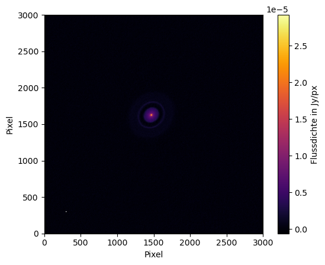

===============================================
pyvisgrid |ci| |pre-commit| |codecov| |license|
===============================================

.. |ci| image:: https://github.com/radionets-project/pyvisgrid/actions/workflows/ci.yml/badge.svg?branch=main
    :target: https://github.com/radionets-project/pyvisgrid/actions/workflows/ci.yml?branch=main
    :alt: Test Status

.. |codecov| image:: https://codecov.io/github/radionets-project/pyvisgrid/badge.svg
    :target: https://codecov.io/github/radionets-project/pyvisgrid
    :alt: Code coverage

.. |pre-commit| image:: https://results.pre-commit.ci/badge/github/radionets-project/pyvisgrid/main.svg
    :target: https://results.pre-commit.ci/latest/github/radionets-project/pyvisgrid/main
    :alt: pre-commit.ci status

.. |license| image:: https://img.shields.io/badge/License-MIT-blue.svg
    :target: https://opensource.org/license/mit
    :alt: License: MIT

Installation
============

You can install the necessary packages in a mamba/conda environment of your choice by executing

.. code::

  $ pip install -e .

We recommend using a conda/mamba environment with ``python`` version ``<=3.11``.

If you want to use features from the NRAO CASAtools package, make sure you are using ``python`` 3.10 or 3.11.

Example
========

The following images show the different images resulting from the gridding process
of a simulated observation of the protoplanetary disk **Elias 24** from the
`DSHARP <https://almascience.eso.org/almadata/lp/DSHARP/>`_.

The visibilities were generated using ``pyvisgen`` using the ALMA Cylce- -9 configuration and gridded using ``pyvisgrid``.

Model input of the simulation
-----------------------------

Ungridded :math:`(u,v)` coverage of the simulated observation
-------------------------------------------------------------

.. image:: ./assets/elias24_example_ungridded_uv.png
	:width: 49.5%

Amplitude (left) and Phase (right) of the gridded visibilities
--------------------------------------------------------------

.. |mask_abs| image:: ./assets/elias24_example_mask_abs.png
	:width: 49.5%

.. |mask_phase| image:: ./assets/elias24_example_mask_phase.png
	:width: 49.5%

|mask_abs| |mask_phase|

Dirty image created from the simulated :math:`(u,v)` coverage.
--------------------------------------------------------------

.. image:: ./assets/elias24_example_dirty_image.png
	:width: 49.5%
